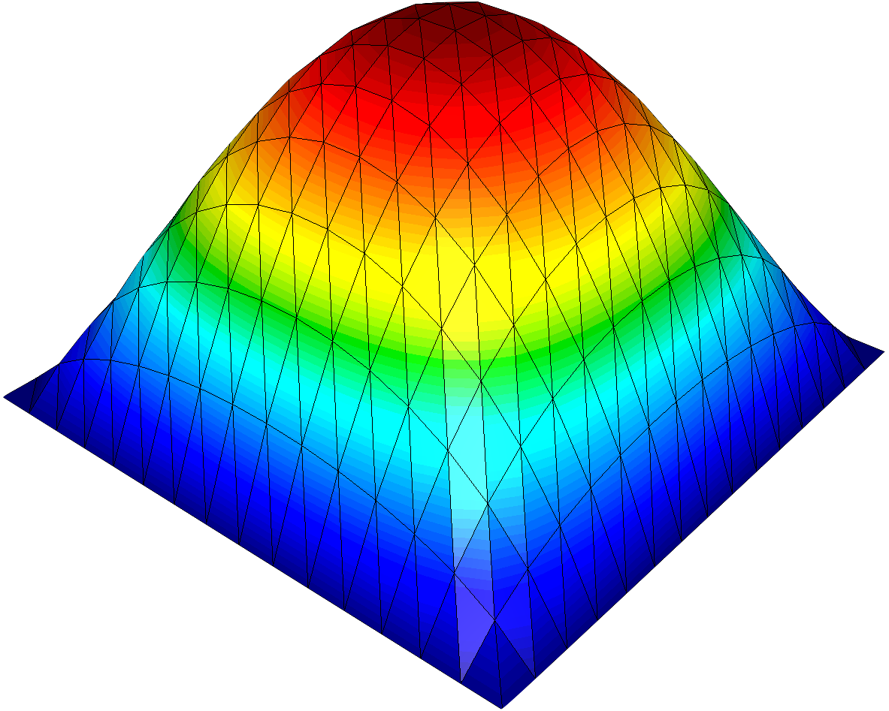

# Rodin [](https://github.com/cbritopacheco/rodin/blob/master/LICENSE)

Rodin is a lightweight and modular finite element framework which provides many of the associated functionalities that are needed when implementing shape and topology optimization algorithms. These functionalities range from refining and remeshing the underlying shape, to providing elegant mechanisms to specify and solve variational problems.

It is named after the French sculptor Auguste Rodin, considered the founder of modern sculpture.

The library is still in development. It is primarily maintained by [Carlos Brito-Pacheco](https://edp-ljk.imag.fr/author/carlos-brito-pacheco/) and was developed to generate examples for his ongoing PhD.

Any contributors are warmly encouraged and any help or comments are always appreciated!

## Status

| Branch      |  Matrix  | Tests | Code Coverage | Benchmarks | Documentation |
|:-----------:|:--------:|:-----:|:-------------:|:----------:|:-------------:|
| master      | [](https://github.com/cbritopacheco/rodin/actions/workflows/Build.yml?query=branch%3Amaster) | [](https://github.com/cbritopacheco/rodin/actions/workflows/Tests.yml?query=branch%3Amaster) | [](https://app.codecov.io/gh/cbritopacheco/rodin/tree/master)  | [](https://cbritopacheco.github.io/rodin/benchmarks/refs/heads/master/) | [](https://cbritopacheco.github.io/rodin/docs/refs/heads/master) |
| develop     | [](https://github.com/cbritopacheco/rodin/actions/workflows/Build.yml?query=branch%3Adevelop) | [](https://github.com/cbritopacheco/rodin/actions/workflows/Tests.yml?query=branch%3Adevelop) | [](https://app.codecov.io/gh/cbritopacheco/rodin/tree/develop) | [](https://cbritopacheco.github.io/rodin/benchmarks/refs/heads/develop/) | [](https://cbritopacheco.github.io/rodin/docs/refs/heads/develop) |

## Table of Contents

1. [Installation](#installation)
2. [Building the project](#building-the-project)
3. [Features](#features)
4. [Architecture and Design](#architecture-and-design)
5. [Examples](#examples)
6. [Testing](#testing)
7. [Third-Party integrations](#third-party-integrations)
8. [Requirements](#requirements)
9. [CMake options](#cmake-options)
10. [Building the documentation](#building-the-documentation)
11. [Contributing](#contributing)
12. [Frequently Asked Questions](#frequently-asked-questions)
13. [License](#license)
14. [Citation](#citation)


## Installation

### Building from Source

#### Prerequisites

- [CMake 3.16.0+](https://cmake.org/)
- [Boost 1.74+](https://www.boost.org/)
- A C++17 compatible compiler (GCC 7+, Clang 5+, MSVC 2017+)

#### Build Steps

```bash
git clone --recursive https://github.com/cbritopacheco/rodin
cd rodin
mkdir build && cd build
cmake ..
make -j4
```

## Building the project

For detailed build instructions, see the [Installation](#installation) section above.

Quick build:

```bash
git clone --recursive https://github.com/cbritopacheco/rodin
cd rodin
mkdir build && cd build
cmake ..
make -j4
```

## Features

### Embedded form language for FEM modelling

Rodin comes with a native C++20 form language for assembling
and solving variational formulations.

For example, given a domain $\Omega$ with boundary $\Gamma := \partial \Omega$, the Poisson problem:
```math
\left\{
\begin{aligned}
 -\Delta u &= f && \text{in } \Omega\\
 u &= 0 && \text{on } \Gamma \ ,
\end{aligned}
\right.
```
has the associated weak formulation:
```math
\text{Find} \ u \in H^1(\Omega) \quad \text{s.t.} \quad \forall v \in H^1_0(\Omega), \quad \int_\Omega \nabla u \cdot \nabla v \ dx = \int_\Omega f v \ dx, \quad \text{with } \quad H^1_0(\Omega) := \{ v \in H^1(\Omega) \mid v = 0 \text{ on } \Gamma \}
```

which can be quickly implemented via the following lines of code:

```c++
#include <Rodin/Solver.h>
#include <Rodin/Geometry.h>
#include <Rodin/Variational.h>

using namespace Rodin;
using namespace Rodin::Geometry;
using namespace Rodin::Variational;

int main(int, char**)
{
  Mesh Omega;
  Omega = Omega.UniformGrid(Polytope::Type::Triangle, 16, 16);
  mesh.getConnectivity().compute(1, 2);

  P1 Vh(Omega);

  TrialFunction u(Vh);
  TestFunction v(Vh);

  Solver::SparseLU solver;

  Problem poisson(u, v);
  poisson = Integral(Grad(u), Grad(v))
          - Integral(v)
          + DirichletBC(u, Zero());
  poisson.solve(solver);

  return 0;
}
```

<table>
  <tr>
    <td align="center">
      
    </td>
  </tr>
  <tr>
    <td align="center">
      Solution of the Poisson equation.
    </td>
  </tr>
</table>

### Full high level mesh access and functionalities

#### Cell, Face, Vertex Iterators

The API offers full support for iteration over _all_ polytopes of the mesh of some given dimension:

```c++
Mesh mesh;
mesh = mesh.UniformGrid(Polytope::Type::Triangle, 16, 16); // 2D Mesh

for (auto it = mesh.getCell(); it; ++it)
{
 // Access information about the cell
}

for (auto it = mesh.getFace(); it; ++it)
{
 // Access information about the face
}

for (auto it = mesh.getVertex(); it; ++it)
{
 // Access information about the vertex
}

for (auto it = mesh.getPolytope(1); it; ++it)
{
 // Access information about the face (face dimension in 2D is equal to 1)
}


```

#### Full connectivity computation

Rodin is able to compute any connectivity information on the mesh. For example, the following computes
the adjacency information from faces to cells:

```c++
Mesh mesh;
mesh = mesh.UniformGrid(Polytope::Type::Triangle, 16, 16); // 2D Mesh

mesh.getConnectivity().compute(1, 2);
```

In general, this means that given a face, we are able to obtain the incident (neighboring) cells.

However, one can also compute any connectivity information on different dimensions.
For example, for a mesh $\mathcal{T}_h \subset \mathbb{R}^d$, $d = 2$ of topological dimension $d$, we have:

```c++
// Compute connectivity between vertices and faces
// i.e. Given a vertex, give me the incident edges
mesh.getConnectivity().compute(0, 1);

// Compute connectivity between faces and cells
// i.e. Given a vertex, give me the incident cells
mesh.getConnectivity().compute(0, 2); 

// Compute connectivity between faces
// i.e. Given a face, give me the adjacent faces
mesh.getConnectivity().compute(1, 1);

// Compute connectivity between cells
// i.e. Given a cell, give me the adjacent cells
mesh.getConnectivity().compute(2, 2);

// Compute connectivity between cells and faces
// i.e. Given a cell, give me the adjacent faces
mesh.getConnectivity().compute(2, 1);

// Etc.
```

### Direct integration with Eigen solvers

### Detailed documentation

Rodin comes with comprehensive documentation that is built automatically on each merge, ensuring it's always up to date. The documentation includes:

- **API Reference**: Complete C++ API documentation with examples
- **User Guide**: Step-by-step tutorials and usage patterns  
- **Examples**: Fully documented example programs
- **Mathematical Foundations**: Theory behind the finite element methods

[The documentation can be found here](https://cbritopacheco.github.io/rodin/).

The documentation is built using Doxygen with optional m.css styling for a modern appearance.

### Support for different finite elements

### Support for different mesh and solution file formats

- MFEM
- MEDIT

### Different quadrature formulae

Rodin supports different kinds of quadrature.

- Grundmann-Moeller

[See here for the full list](https://cbritopacheco.github.io/rodin/docs/refs/heads/master/group___rodin_quadrature.html).

### SubMesh support

Rodin provides comprehensive support for sub-meshes, allowing you to work with portions of your mesh for boundary conditions, material interfaces, or domain decomposition.

```c++
// Create a submesh from boundary elements
auto boundary = mesh.getBoundary();

// Create submesh from specific regions
auto region = mesh.getRegion(materialId);

// Work with submesh connectivity
auto subConnectivity = submesh.getConnectivity();
```

### High-Performance Computing Support

Rodin is designed with performance in mind:

- **Parallel Assembly**: Multi-threaded assembly using OpenMP
- **Memory Efficient**: Optimized data structures for large-scale problems
- **Vectorization**: SIMD-optimized inner loops where possible
- **Cache-Friendly**: Memory access patterns optimized for modern architectures

Performance characteristics:
- Assembly scales efficiently with OpenMP threads
- Memory usage: ~10-50 MB per million degrees of freedom
- Supports problems with millions of unknowns on standard workstations

### Advanced Mesh Operations

Beyond basic mesh handling, Rodin provides advanced mesh operations:

```c++
// Mesh refinement
mesh.refine(refinementCriteria);

// Mesh adaptation with MMG
MMG::Optimizer optimizer;
optimizer.setMetric(metricTensor).optimize(mesh);

// Mesh partitioning for parallel computing
auto partitioner = METIS::Partitioner();
auto partitions = partitioner.partition(mesh, numParts);

// Mesh quality assessment
auto quality = mesh.getQuality();
```

## Examples

Rodin comes with over 70 comprehensive examples demonstrating various features and use cases. The examples are organized into the following categories:

### Core Examples

#### PDEs (Partial Differential Equations)
- **Poisson**: Classic Poisson equation with Dirichlet boundary conditions
- **Helmholtz**: Wave equation and acoustic problems
- **Darcy**: Flow in porous media
- **Elasticity**: Linear elasticity problems and structural mechanics
- **Periodic**: Problems with periodic boundary conditions
- **SurfaceMesh**: PDEs on surface meshes

#### Geometry and Mesh Operations
- **Mesh Loading**: Import meshes from various formats (MFEM, MEDIT, Gmsh)
- **Connectivity**: Compute and use mesh connectivity information
- **Refinement**: Adaptive and uniform mesh refinement
- **SubMesh**: Working with boundary and region submeshes

#### Variational Formulations
- **P0/P1 Elements**: Discontinuous and continuous finite elements
- **Form Assembly**: Matrix and vector assembly patterns
- **Projections**: L2 and H1 projections
- **Integration**: Custom quadrature and integration

### Advanced Examples

#### Shape and Topology Optimization
- **Cantilever**: Classic cantilever beam optimization
- **Arch Problems**: Structural optimization of arches
- **Level Set Methods**: Topology optimization using level sets
- **Eigenvalue Problems**: Frequency optimization

#### Boundary and Surface Optimization
- **Acoustic Cloaking**: Shape optimization for acoustic devices
- **Surface Cooling**: Heat transfer optimization
- **Water Tank**: Fluid optimization problems

#### High-Performance Computing
- **MPI Examples**: Parallel computing with message passing
- **Shared Memory**: OpenMP parallelization examples
- **PETSc Integration**: Advanced linear algebra and solvers

#### Specialized Modules
- **MMG Integration**: Mesh adaptation and optimization
- **Plotting**: Visualization and output generation
- **Alert System**: Error handling and debugging

### Building and Running Examples

```bash
# Build all examples
mkdir build && cd build
cmake .. -DRODIN_BUILD_EXAMPLES=ON
make -j4

# Run specific examples
./examples/PDEs/Poisson
./examples/ShapeOptimization/SimpleCantilever2D
./examples/MPI/Variational/P1

# Run with different parameters
./examples/PDEs/Helmholtz --frequency 100 --mesh coarse.mesh
```

### Example Code Patterns

Most examples follow a consistent pattern:

```c++
#include <Rodin/Rodin.h>

int main() {
    // 1. Load or generate mesh
    Geometry::Mesh<Context::Sequential> mesh;
    mesh.load("domain.mesh", IO::FileFormat::MFEM);
    
    // 2. Define finite element space
    auto Vh = FiniteElementSpace<Context::Sequential>(mesh, FE::P1{});
    
    // 3. Define variational problem
    auto u = TrialFunction(Vh);
    auto v = TestFunction(Vh);
    
    // 4. Assemble system
    auto a = BilinearForm(u, v).add(Integral(Grad(u), Grad(v)));
    auto l = LinearForm(v).add(Integral(f, v));
    
    // 5. Apply boundary conditions and solve
    // ...
    
    return 0;
}
```

All examples include detailed comments and are located in the `examples/` directory with comprehensive documentation explaining the mathematical background and implementation details.

## Architecture and Design

### Core Design Principles

Rodin follows several key design principles that make it both powerful and easy to use:

#### Template-Based Architecture
- **Compile-time optimization**: Extensive use of C++ templates for zero-cost abstractions
- **Type safety**: Strong typing system prevents common FEM implementation errors
- **Generic programming**: Write code once, works with different element types and dimensions

#### Modular Design
- **Plugin architecture**: Easy to extend with new finite elements, solvers, or mesh formats
- **Separation of concerns**: Clear separation between geometry, discretization, and solving
- **Composable components**: Mix and match different components as needed

#### Modern C++ Features
- **C++17/20 compliance**: Uses modern language features for cleaner, safer code
- **RAII**: Automatic resource management prevents memory leaks
- **Move semantics**: Efficient handling of large objects like meshes and matrices

### Library Structure

```
Rodin/
├── Geometry/          # Mesh handling, connectivity, I/O
├── Variational/       # Finite element spaces, forms, assembly
├── Math/              # Linear algebra, solvers, algorithms
├── Context/           # Execution contexts (Sequential, MPI)
├── IO/                # File format support
├── Alert/             # Error handling and debugging
└── External/          # Third-party integrations
```

### Memory Management

Rodin uses smart memory management strategies:

- **Automatic memory management**: RAII and smart pointers eliminate manual memory management
- **Memory pools**: Efficient allocation for temporary objects during assembly
- **Copy-on-write**: Expensive operations are delayed until actually needed
- **Memory mapping**: Large mesh files can be memory-mapped for efficiency

### Thread Safety

- **Thread-safe assembly**: Parallel assembly using OpenMP with proper synchronization
- **Immutable data structures**: Many core objects are immutable after construction
- **Local storage**: Thread-local storage for temporary data in parallel sections

## Testing

Rodin includes a comprehensive test suite covering unit tests, manufactured solutions, and benchmarks.

### Running Tests

```bash
# Build with tests enabled
cmake .. -DRODIN_BUILD_UNIT_TESTS=ON -DRODIN_BUILD_MANUFACTURED_TESTS=ON -DRODIN_BUILD_BENCHMARKS=ON
make -j4

# Run all tests
ctest

# Run specific test categories
ctest -R unit        # Run unit tests only
ctest -R manufactured # Run manufactured solution tests
ctest -R benchmarks  # Run benchmarks
```

### Test Categories

- **Unit Tests**: Component-level testing of individual modules
- **Manufactured Tests**: Verification against known analytical solutions
- **Benchmarks**: Performance testing and regression monitoring

Test results and coverage reports are automatically generated in CI/CD pipelines.

### Enhanced Test Coverage

- **Code coverage**: Detailed coverage reports generated for all test runs
- **Integration tests**: End-to-end testing of complete workflows
- **Regression testing**: Automated detection of performance regressions
- **Cross-platform validation**: Ensures consistency across different operating systems

## Third-Party integrations

Rodin integrates seamlessly with several high-quality third-party libraries to provide extended functionality.

### MMG - Mesh Adaptation

[MMG](https://github.com/MmgTools/mmg) is an open source software for bidimensional and tridimensional surface and volume remeshing.

```c++
#include <Rodin/External/MMG.h>

// Load the mesh
MMG::Mesh Omega;
Omega.load(meshFile, IO::FileFormat::MEDIT);

// Configure optimization parameters
MMG::Optimizer optimizer;
optimizer.setHMax(hmax)         // maximal edge size
         .setHMin(hmin)         // minimal edge size
         .setGradation(hgrad)   // ratio between two edges
         .setHausdorff(hausd)   // curvature refinement
         .setAngleDetection(45) // angle for ridge detection
         .optimize(Omega);

// Use optimized mesh in Rodin
Geometry::Mesh<Context::Sequential> mesh;
mesh = MMG::convert(Omega);
```

### PETSc - Advanced Linear Algebra

[PETSc](https://petsc.org/) provides scalable parallel linear algebra and solvers.

```c++
#include <Rodin/External/PETSc.h>

// Create PETSc-based finite element space
auto Vh = FiniteElementSpace<Context::PETSc>(mesh, FE::P1{});

// Use PETSc solvers
PETSc::KSP solver;
solver.setType(PETSc::KSPGMRES)
      .setPreconditioner(PETSc::PCILU)
      .setTolerances(1e-8, 1e-12, PETSC_DEFAULT, 1000)
      .solve(A, x, b);
```

### MPI - Parallel Computing

Built-in MPI support for distributed computing:

```c++
#include <Rodin/Context/MPI.h>

// Initialize MPI context
Context::MPI context;

// Create distributed mesh
auto mesh = Geometry::Mesh<Context::MPI>::load("mesh.mfem");

// Parallel finite element space
auto Vh = FiniteElementSpace<Context::MPI>(mesh, FE::P1{});

// Parallel assembly automatically handled
auto a = BilinearForm(Vh, Vh).add(Integral(Grad(u), Grad(v)));
```

### METIS - Graph Partitioning

[METIS](http://glaros.dtc.umn.edu/gkhome/metis/metis/overview) for mesh partitioning:

```c++
#include <Rodin/External/METIS.h>

// Partition mesh for parallel computing
METIS::Partitioner partitioner;
auto partitions = partitioner.setNumParts(nprocs)
                             .setMethod(METIS::KWAY)
                             .partition(mesh);
```

### Boost - Core Utilities

Extensive use of [Boost](https://www.boost.org/) libraries:

- **Boost.Geometry**: Geometric algorithms and spatial data structures
- **Boost.Graph**: Graph algorithms for mesh connectivity
- **Boost.Multi-Array**: Efficient multi-dimensional arrays
- **Boost.MPI**: High-level MPI interface
- **Boost.Serialization**: Object serialization for checkpointing

### SuiteSparse - Sparse Linear Algebra

[SuiteSparse](https://sparse.tamu.edu/) provides advanced sparse matrix algorithms:

```c++
// Use UMFPACK for direct sparse solving
SuiteSparse::UMFPACK solver;
solver.factorize(A).solve(x, b);

// Use CHOLMOD for symmetric positive definite systems
SuiteSparse::CHOLMOD solver;
solver.factorize(A).solve(x, b);
```

## Roadmap

List of features and modules that are in the works:
  - Discontinuous Galerkin methods
  - `Rodin::Plot` module
  - H1
  - L2
  - HDiv
  - HCurl
  - P2
  - P0
  - PETSc
  - METIS

## Requirements

### Core Dependencies

- **CMake 3.16.0+**: Build system
- **Boost 1.74+**: C++ libraries for various utilities
- **C++17 compatible compiler**: 
  - GCC 7.0+
  - Clang 5.0+
  - MSVC 2017+

### Optional Dependencies

The following dependencies are optional and enable additional features:

- **MPI**: For parallel computing support (`-DRODIN_USE_MPI=ON`)
- **OpenMP**: For shared-memory parallelization (`-DRODIN_USE_OPENMP=ON`)
- **SuiteSparse**: For additional sparse linear algebra support (`-DRODIN_USE_SUITESPARSE=ON`)
- **PETSc**: For advanced linear algebra and parallel solvers
- **MMG**: For mesh adaptation and optimization
- **Doxygen 1.8.15+**: For building documentation (`-DRODIN_BUILD_DOC=ON`)
- **LaTeX**: For styled documentation with m.css (`-DRODIN_USE_MCSS=ON`)

### Platform Support

Rodin has been tested on:
- Linux (Ubuntu 18.04+, CentOS 7+)
- macOS (10.14+)
- Windows (MSVC 2017+)

All dependencies should be available from standard package managers (apt, yum, brew, vcpkg).

### Installation Troubleshooting

#### Common Build Issues

**Boost not found:**
```bash
# Ubuntu/Debian
sudo apt-get install libboost-all-dev

# CentOS/RHEL
sudo yum install boost-devel

# macOS
brew install boost

# Or specify Boost location
cmake .. -DBOOST_ROOT=/path/to/boost
```

**CMake version too old:**
```bash
# Install newer CMake from Kitware
wget -O - https://apt.kitware.com/keys/kitware-archive-latest.asc | sudo apt-key add -
sudo apt-add-repository 'deb https://apt.kitware.com/ubuntu/ focal main'
sudo apt-get update && sudo apt-get install cmake
```

**C++17 compiler issues:**
```bash
# Ensure modern compiler
sudo apt-get install gcc-9 g++-9
export CC=gcc-9 CXX=g++-9
cmake .. -DCMAKE_CXX_COMPILER=g++-9
```

**Git submodule problems:**
```bash
# Ensure submodules are properly initialized
git submodule update --init --recursive

# Or clone with submodules
git clone --recursive https://github.com/cbritopacheco/rodin
```

#### Runtime Issues

**Segmentation faults:**
- Usually indicate mesh connectivity issues or boundary condition problems
- Use debug builds: `cmake .. -DCMAKE_BUILD_TYPE=Debug`
- Enable Rodin assertions: `cmake .. -DRODIN_ENABLE_ASSERTIONS=ON`

**Performance problems:**
- Ensure release build: `cmake .. -DCMAKE_BUILD_TYPE=Release`
- Enable OpenMP: `cmake .. -DRODIN_USE_OPENMP=ON`
- Check memory usage with tools like `valgrind` or `heaptrack`

**Convergence issues:**
- Verify boundary conditions are properly applied
- Check mesh quality and element orientation
- Try different solvers or preconditioners

## CMake options

| Option                 | Description                                       |
|------------------------|---------------------------------------------------|
| RODIN_BUILD_SRC        | Build the Rodin source code                      |
| RODIN_BUILD_EXAMPLES   | Build the examples in the `examples/` directory  |
| RODIN_BUILD_DOC        | Build the documentation using Doxygen            |
| RODIN_USE_MCSS         | Use m.css style documentation                    |
| RODIN_BUILD_UNIT_TESTS | Build unit tests                                 |
| RODIN_BUILD_MANUFACTURED_TESTS | Build manufactured solution tests      |
| RODIN_BUILD_BENCHMARKS | Build benchmark tests                            |
| RODIN_WITH_PLOT        | Build the Rodin::Plot module                     |
| RODIN_USE_MPI          | Build with MPI support                           |
| RODIN_USE_OPENMP       | Build with OpenMP support                        |
| RODIN_USE_SUITESPARSE  | Build with SuiteSparse support                   |
| RODIN_SILENCE_WARNINGS | Silence warnings outputted by Rodin              |

## Building the documentation

See [this page](doc/README.md) to see how to build the documentation.

## Contributing

Contributions to Rodin are warmly welcomed! Whether you're fixing bugs, adding features, improving documentation, or providing examples, your help is appreciated.

### Getting Started

1. Fork the repository
2. Create a feature branch: `git checkout -b feature/amazing-feature`
3. Make your changes
4. Build and test your changes: `cmake .. && make -j4 && ctest`
5. Commit your changes: `git commit -m 'Add amazing feature'`
6. Push to the branch: `git push origin feature/amazing-feature`
7. Open a Pull Request

### Development Guidelines

#### Code Style
- **Formatting**: Use consistent indentation (2 spaces) and follow existing patterns
- **Naming**: Use PascalCase for classes/types, camelCase for functions/variables
- **Documentation**: Document public APIs with Doxygen-style comments
- **Headers**: Include proper header guards and minimize dependencies

#### Testing Requirements
- **Unit tests**: Add tests for new functionality in the appropriate test directory
- **Manufactured tests**: Add convergence tests for new finite elements or formulations
- **Documentation**: Update documentation and examples as needed
- **Performance**: Ensure new features don't significantly impact performance

#### Code Organization
- **Modularity**: Keep changes focused and minimal
- **Compatibility**: Maintain backward compatibility when possible
- **Error handling**: Use Rodin's Alert system for error reporting
- **Memory management**: Use RAII and smart pointers

### Contribution Types

#### Bug Fixes
- Include minimal reproducible example
- Add regression test if applicable
- Reference issue number in commit message

#### New Features
- Discuss design in GitHub issue first
- Provide comprehensive tests and documentation
- Include examples demonstrating usage

#### Documentation
- Keep documentation up-to-date with code changes
- Improve clarity and add missing sections
- Fix typos and formatting issues

#### Examples
- Provide well-commented examples
- Include mathematical background when relevant
- Test examples in CI pipeline

### Development Environment Setup

```bash
# Clone with development tools
git clone --recursive https://github.com/cbritopacheco/rodin
cd rodin

# Create development build
mkdir debug && cd debug
cmake .. -DCMAKE_BUILD_TYPE=Debug \
         -DRODIN_BUILD_UNIT_TESTS=ON \
         -DRODIN_BUILD_EXAMPLES=ON \
         -DRODIN_BUILD_DOC=ON

# Install development dependencies
sudo apt-get install doxygen graphviz clang-format

# Set up pre-commit hooks (recommended)
cp dev/hooks/pre-commit .git/hooks/
chmod +x .git/hooks/pre-commit
```

### Reporting Issues

When reporting bugs, please include:

- **Version information**: Rodin version, compiler, OS
- **Minimal example**: Shortest code that reproduces the issue
- **Expected vs actual behavior**: Clear description of the problem
- **Error messages**: Full error output and stack traces
- **Build configuration**: CMake options and dependencies

Use the [GitHub issue tracker](https://github.com/cbritopacheco/rodin/issues) to:
- Report bugs with the "bug" label
- Request features with the "enhancement" label  
- Ask questions with the "question" label
- Suggest documentation improvements with the "documentation" label

## Frequently Asked Questions

### General Usage

**Q: How do I get started with Rodin?**
A: Start with the [Installation](#installation) section, then explore the examples in the `examples/` directory. The Poisson example (`examples/PDEs/Poisson.cpp`) is a good starting point.

**Q: What finite element types does Rodin support?**
A: Rodin currently supports P0 (piecewise constant) and P1 (piecewise linear) elements on simplicial meshes. Higher-order elements and other element types are planned for future releases.

**Q: Can I use Rodin for 3D problems?**
A: Yes, Rodin supports 1D, 2D, and 3D problems. The API is dimension-independent, so the same code often works across different dimensions.

**Q: How does Rodin compare to other FEM libraries?**
A: Rodin focuses on ease of use and modern C++ design. It's particularly well-suited for shape optimization and research applications. For production simulations, consider libraries like FEniCS, deal.II, or MFEM.

### Performance and Scalability

**Q: How large problems can Rodin handle?**
A: Rodin can handle problems with millions of degrees of freedom on standard workstations. Performance depends on available memory and the specific problem type.

**Q: Does Rodin support parallel computing?**
A: Yes, Rodin supports both shared-memory parallelism (OpenMP) and distributed-memory parallelism (MPI). See the MPI examples for parallel usage patterns.

**Q: How can I improve performance?**
A: Use release builds (`-DCMAKE_BUILD_TYPE=Release`), enable OpenMP (`-DRODIN_USE_OPENMP=ON`), and consider using optimized linear algebra libraries like MKL or OpenBLAS.

### Development and Integration

**Q: Can I extend Rodin with custom finite elements?**
A: Yes, Rodin's template-based design makes it easy to add new finite element types. See the developer documentation for guidance.

**Q: How do I integrate Rodin with existing code?**
A: Rodin uses standard C++ interfaces and can be integrated as a static or shared library. The CMake build system exports proper target configurations.

**Q: Is there Python support?**
A: Python bindings are currently under development and not yet available. For now, Rodin is a C++-only library.

### Troubleshooting

**Q: I'm getting compilation errors. What should I do?**
A: Ensure you have a C++17-compatible compiler and all dependencies installed. Check the [Installation Troubleshooting](#installation-troubleshooting) section for common issues.

**Q: My simulation results look wrong. How do I debug?**
A: Start with a debug build (`-DCMAKE_BUILD_TYPE=Debug`) and verify your boundary conditions, mesh quality, and problem formulation. The manufactured solution tests can help verify correctness.

**Q: Where can I find more examples?**
A: The `examples/` directory contains over 70 examples. The [documentation](https://cbritopacheco.github.io/rodin/) also includes detailed tutorials and API references.

## License

Rodin is licensed under the **Boost Software License - Version 1.0**.

This license allows for both commercial and non-commercial use, modification, and distribution of the software. The license is very permissive and compatible with most other licenses.

For the full license text, see the [LICENSE](LICENSE) file in the repository root.

## Citation

If you use Rodin in your research or projects, please cite it as:

```bibtex
@software{brito_pacheco_2023_rodin,
  author       = {Brito-Pacheco, Carlos},
  title        = {Rodin: C++17 finite element method and shape optimization framework},
  version      = {0.0.1},
  year         = {2023},
  url          = {https://github.com/cbritopacheco/rodin},
  license      = {Boost Software License - Version 1.0}
}
```

You can also find the citation information in [CITATION.cff](CITATION.cff) format in the repository.
